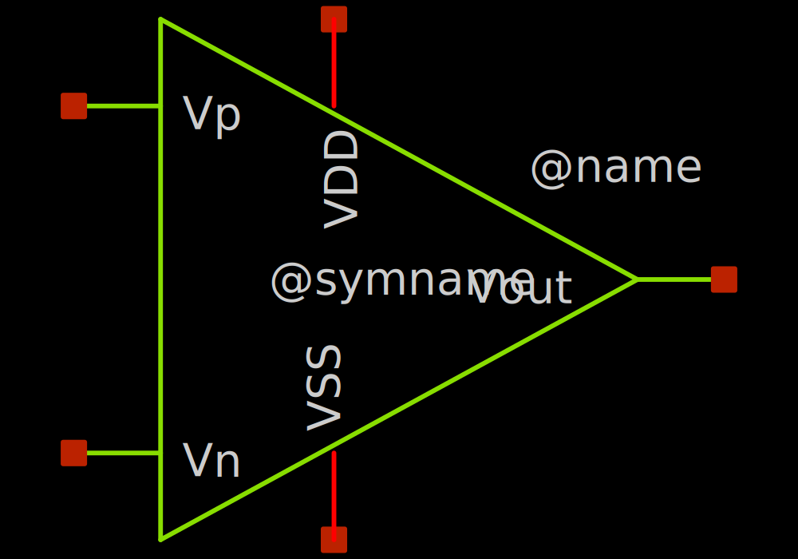
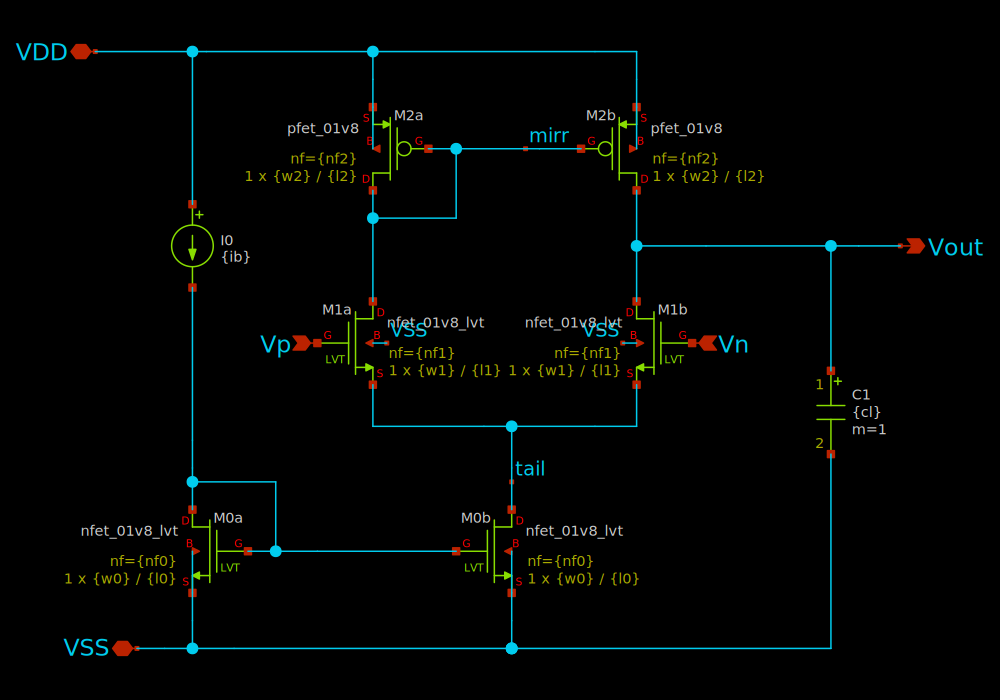

# charge-redistribution-dac

- Description: a simple dac using transmission gates
- PDK: sky130A

## Authorship

- Designer: Saltychip ()
- Company: Ishi-kai
- Created: September 7, 2024
- License: ???
- Last modified: ???

## Pins

- VDD
  + Description: Positive analog power supply
  + Type: power
  + Direction: inout
  + Vmin: 1.7
  + Vmax: 1.9
- VSS
  + Description: Analog ground
  + Type: ground
  + Direction: inout
- Vp
  + Description: Voltage positive input
  + Type: signal
  + Direction: input
- Vn
  + Description: Voltage negative input
  + Type: signal
  + Direction: input
- Vout
  + Description: Voltage output
  + Type: signal
  + Direction: output

## Default Conditions

- vdd
  + Description: Analog power supply voltage
  + Display: Vdd
  + Unit: V
  + Typical: 1.8
- vcm
  + Description: Input common mode voltage
  + Display: Vcm
  + Unit: V
  + Typical: 0.9
- corner
  + Description: Process corner
  + Display: Corner
  + Typical: tt
- temperature
  + Description: Ambient temperature
  + Display: Temp
  + Unit: °C
  + Typical: 27

## Symbol

## Schematic

## Layout

